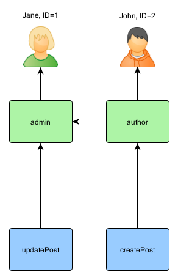
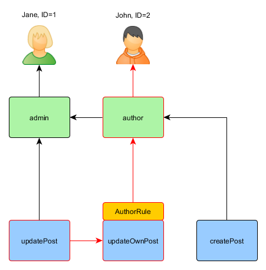

권한 부여
========

인증은 사용자가 어떤 작업을 수행하기에 충분한 권한을 가지고 있는지 확인하는 과정입니다.
YII 는 액세스 제어 필터(ACF)와 역할기반액세스제어 (RBAC) 두가지 인증 방법을 제공합니다.


## 액세스 제어필터 (ACF) <span id="access-control-filter"></span>

액세스 제어 필터 (ACF)는 [[yii\filters\AccessControl]]로 구현되는 단순한 권한 부여 방법이며, 어떤 간단한 액세스 제어를 필요로하는 응용 프로그램에서 사용하기에 가장 적합합니다.
이 이름에서 알 수 있듯이, ACF는 컨트롤러 또는 모듈에서 사용할 수있는 액션 필터 [filter](structure-filters.md)입니다.
ACF는 사용자가 액션의 실행을 요청했을 때 일련의 [[yii\filters\AccessControl::rules|access rules]] 액세스 규칙 을 검사하여 현재 사용자가 작업에 대한 액세스 권한이 있는지 여부 을 결정합니다.

아래의 코드는 `site` 컨트롤러에서 ACF를 사용하는 방법을 보여줍니다.

```php
use yii\web\Controller;
use yii\filters\AccessControl;

class SiteController extends Controller
{
    public function behaviors()
    {
        return [
            'access' => [
                'class' => AccessControl::className(),
                'only' => ['login', 'logout', 'signup'],
                'rules' => [
                    [
                        'allow' => true,
                        'actions' => ['login', 'signup'],
                        'roles' => ['?'],
                    ],
                    [
                        'allow' => true,
                        'actions' => ['logout'],
                        'roles' => ['@'],
                    ],
                ],
            ],
        ];
    }
    // ...
}
```

위의 코드에서 ACF는 `site` 컨트롤러에 비헤이비어(behavior) 로 연결되어 있습니다.
이것이 액션 필터를 사용하는 전형적인 방법입니다.
`only` 옵션은 ACF가 `login`, `logout`, `signup` 의 액션에만 적용되어야 함을 지정합니다.
`site` 컨트롤러의 다른 모든 액션은 ACF의 영향을받지는 않습니다.
`rules` 옵션은 [[yii\filters\AccessRule|access rules]]액세스 규칙을 지정하는 것이며, 다음과 같이 읽을 수 있습니다.

- 모든 손님 계정 (아직 인증되지 않은 사용자)에 'login'과 'singup'의 작업(action)에 액세스 할 수 있도록 허용합니다.
  `roles`의 옵션에 물음표`?` 가 포함되어 있는데, 이것은「손님」을 나타내는 특수한 토큰입니다.
- 인증 된 사용자에게 'logout' 작업(action)에 액세스 할 수 있도록 허용합니다.
  `@`라는 문자는 또 다른 특별한 토큰으로 "인증 된 사용자"를 나타내는 것입니다.

ACF가 권한 검사를 수행 할 때 위에서 아래로 적용된 규칙을 찾을 때까지 확입니다.
그리고 적용되는 규칙의 `allow` 값이 사용자가 권한을 가지고 있는지의 여부를 결정하는데 사용 됩니다.
적용되는 규칙이 하나도없는 경우에는 사용자가 권한이없는 것을 의미하고, ACF는 액션 중지합니다.

사용자가 현재 작업에 액세스하는 권한을 가지고 있지 않다고 판단했을 경우는 기본적으로 ACF는 다음의 방법을 취합니다.

* 사용자가 게스트 인 경우 [[yii\web\User::loginRequired()]]를 호출하여 사용자의 브라우저를 로그인 페이지로 이동합니다.
* 사용자가 이미 인증 된 경우 [[yii\web\ForbiddenHttpException]]을 던집니다.

이 동작은 다음과 같이 [[yii\filters\AccessControl::denyCallback]] 속성을 구성하여 사용자를 정의 할 수 있습니다.

```php
[
    'class' => AccessControl::className(),
    ...
    'denyCallback' => function ($rule, $action) {
        throw new \Exception('You are not allowed to access this page');
    }
]
```

[[yii\filters\AccessRule|Access rules]]은 많은 옵션을 지원합니다.
다음은 지원되는 옵션의 요약입니다.
[[yii\filters\AccessRule]]을 확장하고 자신의 사용자 정의된  액세스 규칙의 클래스를 만들 수 있습니다.

 * [[yii\filters\AccessRule::allow|allow]]: 이것이 "허용"규칙인지, "금지"규칙인지를 지정합니다.

 * [[yii\filters\AccessRule::actions|actions]]: 어떤 액션에 규칙이 적용되는지를 지정합니다.
이것은 액션 ID의 배열이어야합니다.
비교는 대소 문자를 구분합니다.
이 옵션이 비어 있거나 지정되지 않은 경우 규칙이 모든 Action에 적용되는 것을 의미합니다.

 * [[yii\filters\AccessRule::controllers|controllers]]: 어떤 컨트롤러에 이 규칙이 적용되는지를 지정합니다.
이것은 컨트롤러 ID의 배열이어야합니다.
컨트롤러 모듈에 속하는 경우 모듈 ID를 컨트롤러 ID 앞에 넣습니다.
비교는 대소 문자를 구분합니다.
이 옵션이 비어 있거나 지정되지 않은 경우 규칙이 모든 컨트롤러에 적용되는 것을 의미합니다.

 * [[yii\filters\AccessRule::roles|roles]]: 어떤 사용자 역할의 규칙이 적용되는지를 지정합니다.
   두 특별한 역할을 인식합니다.
   이들은 [[yii\web\User::isGuest]]에 의해 결정됩니다.


     - `?`: 게스트 사용자 (아직 인증되지 않은 사용자)를 의미합니다.
     - `@`: 인증 된 사용자를 의미합니다.

   다른 룰의 이름을 사용하면[[yii\web\User::can()]]의 호출이 야기되지만, 그러기 위해서는, RBAC (다음 절에서 설명합니다)를 활성화해야 있습니다.
   이 옵션이 비어 있거나 지정되지 않은 경우 규칙이 모든 역할에 적용되는 것을 의미합니다.

 * [[yii\filters\AccessRule::ips|ips]]: 어떤[[yii\web\Request::userIP|client IP addresses]] 이 규칙이 적용되는지를 지정합니다.
IP 주소는 마지막으로 와일드 카드 `*` 를 포함 할 수 있으며, 같은 접두어를 가진 IP 주소에 일치시킬 수 있습니다.
예를 들어, '192.168. *' 은 '192.168'세그먼트에 속하는 모든 IP 주소와 일치합니다.
이 옵션이 비어 있거나 지정되지 않은 경우 규칙이 모든 IP 주소에 적용되는 것을 의미합니다.

 * [[yii\filters\AccessRule::verbs|verbs]]: 어떤 요청 메소드 (HTTP 동사, 예를 들어 `GET` 과 `POST`)이 규칙이 적용되는지를 지정합니다.
대소 문자를 구별하지 않습니다.

 * [[yii\filters\AccessRule::matchCallback|matchCallback]]: PHP에서 이규칙이 실행되면 이 엑세스는 사용이 승인됩니다.

 * [[yii\filters\AccessRule::denyCallback|denyCallback]]: PHP에서 이 규칙이 실행되면 이엑세서는 호출이 금지 됩니다.

다음은`matchCallback` 옵션을 사용하는 방법을 보여주는 예입니다.
이 옵션은 임의의 액세스 제어 로직에 쓸 수 있습니다.

```php
use yii\filters\AccessControl;

class SiteController extends Controller
{
    public function behaviors()
    {
        return [
            'access' => [
                'class' => AccessControl::className(),
                'only' => ['special-callback'],
                'rules' => [
                    [
                        'actions' => ['special-callback'],
                        'allow' => true,
                        'matchCallback' => function ($rule, $action) {
                            return date('d-m') === '31-10';
                        }
                    ],
                ],
            ],
        ];
    }

    // Match callback called! This page can be accessed only each October 31st
    public function actionSpecialCallback()
    {
        return $this->render('happy-halloween');
    }
}
```

## 역할 기반 액세스 제어 (RBAC) <span id="rbac"></span>

역할 기반 액세스 제어 (RBAC)는 단순하면서도 강력한 중앙 집중식 액세스 제어를 제공합니다.
RBAC 및 다른 더 전통적인 액세스 제어 스키마와 비교에 대한 자세한 내용은 [Wikipedia](http://en.wikipedia.org/wiki/Role-based_access_control)를 참조하십시오.

Yii는, [NIST RBAC 모델] (http://csrc.nist.gov/rbac/sandhu-ferraiolo-kuhn-00.pdf)에 따라 일반 계층 RBAC를 구현하고 있습니다.
RBAC 기능은 [[yii\rbac\ManagerInterface|authManager]] 응용 프로그램 구성 요소 [application component](structure-application-components.md)를 통해 제공됩니다.

RBAC를 사용하는 것에는 두 가지 작업이 포함됩니다.
첫 번째 작업은 RBAC 권한 부여 데이터를 만들어내는 것이며, 두 번째 작업은 권한 부여 데이터를 사용하여 필요한 장소에서 액세스 검사를 수행하는 것입니다.

설명을 쉽게하기 위해 먼저 몇 가지 기본적인 RBAC의 개념을 도입합니다.


### 기본적인 개념 <span id="basic-concepts"></span>

롤 (역할)는 *permissions(허가)* (예를 들어, 기사를 작성하는 기사를 업데이트하는 등)의 모음입니다.
하나의 역할을 한 명 이상의 사용자에게 할당 할 수 있습니다.
사용자가 특정 권한을 가지고 있는지의 여부를 확인하기 위해 그 권한을 포함하는 역할이 사용자에게 할당 된 권한인지 검사 할 수 있습니다.

각 역할이나 권한에 관련된 *규칙* 이 존재할 수 있습니다.
규칙과 액세스 검사시 해당 역할과 권한이 현재 사용자에게 적용되는지 여부를 결정하기 위해 실행되는 코드 조각입니다.
예를 들어, "기사 업데이트" 의 권한은 현재 사용자가 게시물의 작성자인지 여부를 확인하는 규칙을 가질 수 있습니다.
그리고 액세스 검사시 사용자가 문서의 작성자가 아닌 경우, 그/그녀 는  "기사 업데이트"의 권한이없는 것으로 판단 할 수 있습니다.

역할 및 권한은 모두 계층 적으로 구성 할 수 있습니다.
구체적으로 말하면, 하나의 역할은 다른 역할과 권한을 포함 할 수 있으므로 허용된 다른 권한을 포함 할 수 있습니다.
Yii는 일반적인 *partial order* 계층을 구현하고 있는데, 이것은 그 특수형으로 *트리* 계층을 포함합니다.
역할은 권한을 포함 할 수 있지만 권한은 역할을 포함 할 수 없습니다.


### RBAC 구성 <span id="configuring-rbac"></span>

권한 부여 데이터를 정의하고 액세스 검사를 수행하기 전에 [[yii\base\Application::authManager|authManager]] 응용 프로그램 구성 요소를 구성해야합니다.
Yii는 두 종류의 권한 부여 관리자를 제공합니다. 즉, [[yii\rbac\PhpManager]] 와 [[yii\rbac\DbManager]]입니다.
전자는 권한 부여 데이터를 저장하기 위해 PHP 스크립트 파일을 사용하지만, 후자는 권한 부여 데이터를 데이터베이스에 저장합니다.
당신의 응용 프로그램이 매우 동적 역할 및 권한 관리를 필요로하는 경우에, 전자를 사용하는 것을 고려하는 것이 좋습니다.

#### `PhpManager` 사용 <span id="using-php-manager"></span>

다음 코드는 응용 프로그램의 구성 정보에서 [[yii\rbac\PhpManager]] 클래스를 사용하여 `authManager` 을 구성하는 방법을 보여줍니다.

```php
return [
    // ...
    'components' => [
        'authManager' => [
            'class' => 'yii\rbac\PhpManager',
        ],
        // ...
    ],
];
```

이제 `authManager` 은 `\Yii::$app->authManager` 의해 액세스를 가능하게 합니다.

기본적으로 [[yii\rbac\PhpManager]]는 RBAC 데이터를 `@app/rbac` 디렉토리 아래의 파일에 저장합니다.
권한 계층을 온라인으로 변경할 필요가있는 경우는 반드시 웹 서버의 프로세스가 이 디렉토리와 그 안에있는 모든 파일에 대한 쓰기 권한을 가지도록 해야 합니다..

#### `DbManager` 사용 <span id="using-db-manager"></span>

다음 코드는 응용 프로그램의 구성 정보에서 [[yii\rbac\DbManager]] 클래스를 사용하여 `authManager` 을 구성하는 방법을 보여줍니다.


```php
return [
    // ...
    'components' => [
        'authManager' => [
            'class' => 'yii\rbac\DbManager',
        ],
        // ...
    ],
];
```

`DbManager` 는 네 개의 데이터베이스 테이블을 사용하여 데이터를 저장합니다.

- [[yii\rbac\DbManager::$itemTable|itemTable]]: 권한 항목을 저장하기위한 테이블. 기본값은 "auth_item"
- [[yii\rbac\DbManager::$itemChildTable|itemChildTable]]: 권한 항목의 계층 구조를 저장하기위한 테이블. 기본값은 "auth_item_child"
- [[yii\rbac\DbManager::$assignmentTable|assignmentTable]]: 권한 항목 할당을 저장하기위한 테이블. 기본값은 "auth_assignment"
- [[yii\rbac\DbManager::$ruleTable|ruleTable]]: 규칙을 저장하기위한 테이블. 기본값은 "auth_rule"

계속하기 전에 이러한 테이블을 데이터베이스에 작성해야합니다.
그러기 위해서는 `@yii/rbac/migrations` 에 저장되어있는 마이그레이션을 사용할 수 있습니다.

`yii migrate --migrationPath=@yii/rbac/migrations`

이제 `authManager` 은 `\Yii::$app->authManager` 의해 액세스 할 수있게합니다.


### 인증 데이터 구축 <span id="generating-rbac-data"></span>

인증 데이터를 구축하는 작업은 결국 다음 작업에 따릅니다.

- 역할과 권한을 정의하는 단계;
- 역할과 권한 사이의 관계를 설정하는 단계;
- 규칙을 정의하는 단계;
- 역할과 규칙을 권한에 연계;
- 사용자에게 역할을 할당.

권한 부여에 요구되는 유연성의 정도에 따라 위의 작업 방식도 달라집니다.

권한 계층이 전혀 변하지 않고 고정 된 수의 사용자 밖에 존재하지 않는 경우는 `authManager` 가 제공하는 API를 통해 권한 부여 데이터를 설정 콘솔 명령 [console command](tutorial-console.md#create-command)을 통하여 초기에 한번 만들 수 있습니다.

```php
<?php
namespace app\commands;

use Yii;
use yii\console\Controller;

class RbacController extends Controller
{
    public function actionInit()
    {
        $auth = Yii::$app->authManager;

        // add "createPost" permission
        $createPost = $auth->createPermission('createPost');
        $createPost->description = 'Create a post';
        $auth->add($createPost);

        // add "updatePost" permission
        $updatePost = $auth->createPermission('updatePost');
        $updatePost->description = 'Update post';
        $auth->add($updatePost);

        // add "author" role and give this role the "createPost" permission
        $author = $auth->createRole('author');
        $auth->add($author);
        $auth->addChild($author, $createPost);

        // add "admin" role and give this role the "updatePost" permission
        // as well as the permissions of the "author" role
        $admin = $auth->createRole('admin');
        $auth->add($admin);
        $auth->addChild($admin, $updatePost);
        $auth->addChild($admin, $author);

        // Assign roles to users. 1 and 2 are IDs returned by IdentityInterface::getId()
        // usually implemented in your User model.
        $auth->assign($author, 2);
        $auth->assign($admin, 1);
    }
}
```

`yii rbac/init`의 명령을 실행 한 후 다음의 권한 계층을 얻을 수 있습니다.



작성자 (author)는 기사를 게시 할 수 있으며, 관리자 (admin)는 기사를 업데이트 할뿐만 아니라 작성자가 할수 있는 모든 일을 할수 있습니다.

당신의 응용 프로그램이 사용자 자신에 의한 등록을 허용하는 경우 새로 등록 된 사용자에 한번은 역할을 할당해야합니다.
예를 들어, 고급 프로젝트 템플릿에서는 등록 된 사용자 모두를 "작성자"로 하기 위해 `frontend\models\SignupForm::signup()` 을 다음과 같이 수정해야합니다.

```php
public function signup()
{
    if ($this->validate()) {
        $user = new User();
        $user->username = $this->username;
        $user->email = $this->email;
        $user->setPassword($this->password);
        $user->generateAuthKey();
        $user->save(false);

        // the following three lines were added:
        $auth = Yii::$app->authManager;
        $authorRole = $auth->getRole('author');
        $auth->assign($authorRole, $user->getId());

        return $user;
    }

    return null;
}
```

동적으로 업데이트되는 권한 부여 데이터를 가진 복잡한 액세스 제어를 필요로하는 응용 프로그램은 `authManager` 가 제공하는 API를 사용하여 특별한 사용자 인터페이스 (즉, 관리 패널)을 개발해야 합니다.


### 규칙사용 <span id="using-rules"></span>

이미 언급 한 바와 같이 규칙이 역할과 권한에 제약을 추가합니다.
규칙은 [[yii\rbac\Rule]]을 확장 한 클래스이며, [[yii\rbac\Rule::execute()|execute()]]메소드를 구현해야합니다.
이전에 만든 권한 계층에서는 참가자가 자신의 기사를 편집 할 수 없습니다. 이 문제를 해결합시다.
첫째, 사용자가 기사의 작성자임을 확인하는 규칙이 필요합니다.

```php
namespace app\rbac;

use yii\rbac\Rule;

/**
 * Checks if authorID matches user passed via params
 */
class AuthorRule extends Rule
{
    public $name = 'isAuthor';

    /**
     * @param string|integer $user the user ID.
     * @param Item $item the role or permission that this rule is associated with
     * @param array $params parameters passed to ManagerInterface::checkAccess().
     * @return boolean a value indicating whether the rule permits the role or permission it is associated with.
     */
    public function execute($user, $item, $params)
    {
        return isset($params['post']) ? $params['post']->createdBy == $user : false;
    }
}
```

위의 규칙은 `post` 가 `$user` 의해 생성되었는지 를 확인합니다.
다음은 이전에 사용한 명령에서 `updateOwnPost` 라는 특별한 허가를 만듭니다.

```php
$auth = Yii::$app->authManager;

// add the rule
$rule = new \app\rbac\AuthorRule;
$auth->add($rule);

// add the "updateOwnPost" permission and associate the rule with it.
$updateOwnPost = $auth->createPermission('updateOwnPost');
$updateOwnPost->description = 'Update own post';
$updateOwnPost->ruleName = $rule->name;
$auth->add($updateOwnPost);

// "updateOwnPost" will be used from "updatePost"
$auth->addChild($updateOwnPost, $updatePost);

// allow "author" to update their own posts
$auth->addChild($author, $updateOwnPost);
```


이제 다음과 같은 권한 계층입니다.


### Access 확인 <span id="access-check"></span>

권한 부여 데이터가 준비되면 액세스 검사는 [[yii\rbac\ManagerInterface::checkAccess()]] 메소드를 호출하면 되는 간단한 일입니다.
대부분의 액세스 체크는 현재 사용자에 대한 것이므로 Yii는 편리하게, [[yii\web\User::can()]]라는 바로 가기 메서드를 제공합니다.
이것은 다음과 같이 사용할 수 있습니다.

```php
if (\Yii::$app->user->can('createPost')) {
    // create post
}
```

현재 사용자가 `ID=1` 인 Jane이라고하 면`createPost` 에서 시작하여 `Jane` 까지 도달하려고 시도합니다.


사용자가 문서를 업데이트 할 수 있을지 여부를 확인하기 위해 이전에 설명 된 `AuthorRule` 에 의해 요구되는 추가 매개 변수를 전달해야합니다.

```php
if (\Yii::$app->user->can('updatePost', ['post' => $post])) {
    // update post
}
```

현재 사용자가 John이라고하면 다음의 경로를 따라 간다.



`updatePost` 에서 시작하여 `updateOwnPost` 을 통과합니다.
통과하기 위해서는 `AuthorRule` 이 `execute` 메소드에서 `true` 를 반환해야합니다.
`execute` 방법은 `can` 메소드 호출에서 `$params` 를 받고 있으므로, 그 값은`['post' => $post]` 입니다.
모든값이 OK이면 John에게 할당 된  `author` 에 도달합니다.

Jane의 경우는 그녀가 관리자이기 때문에 조금 쉬워집니다.


### 기본 규칙 사용 <span id="using-default-roles"></span>

기본 규칙이라는 것은 *모든* 사용자에 *묵시적* 으로 할당된 값입니다.
[[yii\rbac\ManagerInterface::assign()]]를 호출 필요는없고, 권한 부여 데이터는 그 할당 정보를 포함하지 않습니다.

기본 규칙은 일반적으로 그 역할을 해당 사용자에게 적용되는지 여부를 결정하는 규칙과 연관됩니다.

기본 역할은 대개 어떤 역할 할당을 이미 가지고있는 응용 프로그램에서 사용됩니다.
예를 들어, 응용 프로그램은 사용자의 테이블에 "group"라는 컬럼을 가지고 개별 사용자가 속한 권한 그룹을 나타내는 경우가 있습니다.
각각의 권한 그룹과 RBAC 역할에 매핑 할 수있는 것이라면, 기본 역할 기능을 사용하여 각 사용자에게 RBAC 역할을 자동으로 할당 할 수 있습니다.
어떻게하면 이것이 가능한지 예제를 통해 살펴 보겠습니다.

사용자의 테이블에`group`라는 컬럼이 있고, 1 관리자 그룹 2는 작성자 그룹을 나타내고 있다고 가정합시다.
이 두 그룹의 권한을 표시하기 위해 각각`admin`와`author`하는 RBAC 역할을 만들 수 있습니다.
이 때, 다음과 같이 RBAC 데이터를 설정할 수 있습니다.


```php
namespace app\rbac;

use Yii;
use yii\rbac\Rule;

/**
 * Checks if user group matches
 */
class UserGroupRule extends Rule
{
    public $name = 'userGroup';

    public function execute($user, $item, $params)
    {
        if (!Yii::$app->user->isGuest) {
            $group = Yii::$app->user->identity->group;
            if ($item->name === 'admin') {
                return $group == 1;
            } elseif ($item->name === 'author') {
                return $group == 1 || $group == 2;
            }
        }
        return false;
    }
}

$auth = Yii::$app->authManager;

$rule = new \app\rbac\UserGroupRule;
$auth->add($rule);

$author = $auth->createRole('author');
$author->ruleName = $rule->name;
$auth->add($author);
// ... add permissions as children of $author ...

$admin = $auth->createRole('admin');
$admin->ruleName = $rule->name;
$auth->add($admin);
$auth->addChild($admin, $author);
// ... add permissions as children of $admin ...
```

상기 "author" 가 "admin" 의 자식으로 추가되어 있기 때문에 규칙 클래스의 `execute()`메소드를 구현할 때이 계층 적 관계도 배려해야한다는 점에주의하십시오.
이를 위해 역할 이름이 "author"인 경우는`execute ()`메소드는 사용자 그룹이 1 또는 2 인 (사용자가 "admin"그룹 또는 "author"그룹에 속한) 때 true를 반환합니다.

다음은`authManager` 구성 정보에이 두 역할을 [yii \ rbac \ BaseManager : $ defaultRoles]로 나열합니다.

```php
return [
    // ...
    'components'=>
        'authManager'=>
            'class'=> 'yii \ rbac \ PhpManager'
            'defaultRoles'=> 'admin', 'author',
        ,
        // ...
    ,
];
```

이렇게하면 액세스 검사를 수행하면`admin`와`author` 모두의 역할은 그와 연관된 규칙을 평가하여 확인하실 수 있습니다.
규칙이 true를 반환하면 해당 역할이 현재 사용자에게 적용되게됩니다.
위 규칙의 구현에 따라 말하면, 사용자의`group` 값이 1이면`admin` 롤이 사용자에게 적용되지`group` 값이 2이면`author` 롤이 적용됩니다 하는 것을 의미합니다.
