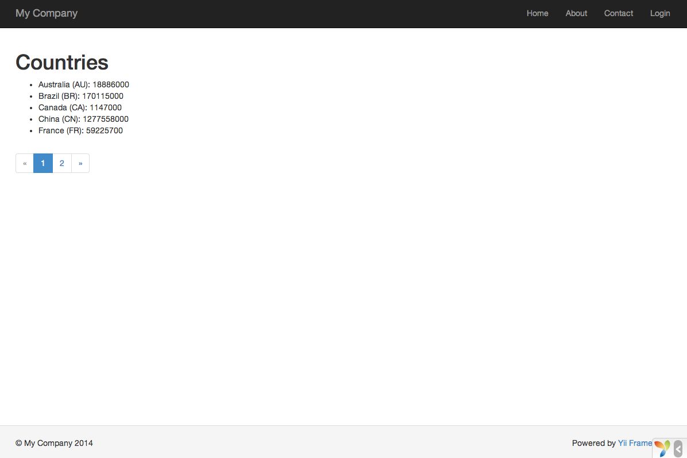

데이터베이스 작업
======================

이 섹션 에서는  `country` 라는 데이터베이스 테이블에서 검색된 데이터를 표시할 새 페이지를 만드는 방법을 설명합니다.
이 목표를 도달 하기 위하여, 데이터베이스 연결을 설정후 [엑티브 레코드](db-active-record.md) 클래스를 생성, [액션](structure-controllers.md)컨트롤을 정희후 , [뷰] (structure-views.md)를 만듭니다.

이 튜토리얼을 통해 다음을 배우게 됩니다.

* DB 연결을 구성하는방법
* 엑티브 레코드 클래스를 정의 하는 방법
* 엑티브 레코드 클래스를 사용하여 쿼리 데이터를 사용하는 방법
* 페이징 처리를 하여 데이터를 표시는 방법

이 섹션을 완료 하는 데 데이터베이스를 사용 하는 것에 대 한 기본적인 지식과 경험이 없다면 하지 않는 것이 좋습니다.
Note that in order to finish this section, you should have basic knowledge and experience using databases.
다시 말하면, DB 클라이언트 도구를 사용하여 데이터베이스 만드는 방법과, SQL 문장을 실행하는 방법을 알고 있어야 합니다.


데이타베이스 준비하기 <span id="preparing-database"></span>
----------------------

먼저, `yii2basic`으로 데이타베이스를 생성합니다. 응용프로그램은 이 데이타베이스 에서 데이터를 사용합니다.
Yii은 SQLite, MySQL, PosttreSQL, MSSQL 이나 Oracle등 많은 데이타베이스에 대한 지원을 하고 있으며, 모두 선택할수 있습니다.
간단하게 앞으로 Mysql 기준으로 설명을 하겠습니다.

데이터 베이스에서 `country` 라는 테이블을 만들고 몇가지 예제 데이터들을 등록합니다.
이렇게 하려면 다음 SQL 문을 실행 하면됩니다.

```sql
CREATE TABLE `country` (
  `code` CHAR(2) NOT NULL PRIMARY KEY,
  `name` CHAR(52) NOT NULL,
  `population` INT(11) NOT NULL DEFAULT '0'
) ENGINE=InnoDB DEFAULT CHARSET=utf8;

INSERT INTO `country` VALUES ('AU','Australia',18886000);
INSERT INTO `country` VALUES ('BR','Brazil',170115000);
INSERT INTO `country` VALUES ('CA','Canada',1147000);
INSERT INTO `country` VALUES ('CN','China',1277558000);
INSERT INTO `country` VALUES ('DE','Germany',82164700);
INSERT INTO `country` VALUES ('FR','France',59225700);
INSERT INTO `country` VALUES ('GB','United Kingdom',59623400);
INSERT INTO `country` VALUES ('IN','India',1013662000);
INSERT INTO `country` VALUES ('RU','Russia',146934000);
INSERT INTO `country` VALUES ('US','United States',278357000);
```

이 시점에, `yii2basic`이라는 이름의 데이타베이시스를 가지고 있으며, 그중에 3개의 컬럼을 가진 `country` 테이블이 있으며. 이 테이블은 10개의 row 데이터를 가지고 있을 것입니다.

DB 연결 구성 <span id="configuring-db-connection"></span>
------------

진행하기 전에, [PDO](http://www.php.net/manual/en/book.pdo.php)와 사용하려는 데이타베이스에 대한 PDO 드라어버(예를 들면, MySQL을 위한 `pdo_mysql`)등이 설치되었는지 확인하세요.
응용 프로그램이 관계형 데이타베이스를 사용하는 경우 이것은 기본적인 필수 조건입니다.

설치하는 경우 `config/db.php`파일을 열고 데이타베이스에 맞게 파라메터 값을 수정하셔야 합니다.
디폴트 파일은 아래처럼 설정되어 있습니다.

```php
<?php

return [
    'class' => 'yii\db\Connection',
    'dsn' => 'mysql:host=localhost;dbname=yii2basic',
    'username' => 'root',
    'password' => '',
    'charset' => 'utf8',
];
```

이 `config/db.php` 파일은 파일 기반 [구성](concept-configurations.md)도구 입니다.
이 구성 파일은 기본 데이터베이스에 대해 SQL 쿼리의 실행을 허용 하는 [[yii\db\Connection]] 인스턴스를 만들고 초기화 하는 데 필요한 매개 변수를 지정 합니다.

위와 같이 DB연결이 된 경우, 응용프로그램에서 `Yii::$app->db` 처럼 액세스 할수 있습니다.

> info | 정보: `config/db.php`는 기본 응용프로그램 구성 파일인 `config/web.php`에 의해 포함됩니다. `config/web.php`가 [응용프로그램](structure-applications.md)인스턴스가 초기화 되는 방식 지정합니다. 자세한 정보는 [설정](concept-configurations.md)을 참조하세요.


엑티브 레코드 만들기 <span id="creating-active-record"></span>
-------------------------

`country`테이블의 데이터를 가져오기 위해, [엑티브 레코드](db-active-record.md)에서 파생된 `Country`라는 클래스 명을 만들고, `models/Country.php` 파일로 저장합니다.

```php
<?php

namespace app\models;

use yii\db\ActiveRecord;

class Country extends ActiveRecord
{
}
```

`Country` 클래스는 [[yii\db\ActiveRecord]]에서 확장 됩니다. 위의 코드 안에 코드를 작성할 필요가 없으며, 위의 코드만으로 Yii는 연결된 테이블을 클래스 이름에서 참조 하여 가져옵니다.

> Info | 정보: 클래스 이름과 테이블 이름이 직접 일치 시킬 수 없는 경우에는  [[yii\db\ActiveRecord::tableName()]] 메서드를 재정의 하여 연결될 테이블 이름을 명시적으로 지정할수 있습니다.

`Country` 클래를 사용하여 아래 보기 화면 처럼 `country` 테이블의 데이터를 쉽게 조작 할수 있습니다.

```php
use app\models\Country;

// country 테이블 에서 모든 행을 검색하여 "name" 으로 정렬
$countries = Country::find()->orderBy('name')->all();

// primary 키가 "US"인 행을 검색
$country = Country::findOne('US');

// "United States"을 표시 
echo $country->name;

// country 명을 "U.S.A." 로 수정하여 데이타베이스에 저장
$country->name = 'U.S.A.';
$country->save();
```

> Info | 정보: 엑티브 레코드는 객체지향 방식에서 데이타베이스의 데이타에 액세스 하고 조작 하는 강력한 방법입니다.
[엑티브 레코드](db-active-record.md)에서 자세한 정보를 볼수 있습니다.
또 다른 방법은, [데이터 액세스 개체](db-dao.md) 라는 보다 하위 수준의 데이터 액세스 방법을 사용 하여 데이터베이스를 조작할 수 있습니다.


액션 만들기 <span id="creating-action"></span>
-----------

country 데이타를 표시하기 위해서, 액션을 새로 만들어야 합니다. 지금 까지의 색션에서는 `site`컨트롤러에서 작업을 했지만, country 데이타에 관련된 모든 작업들은 새로운 컨트롤러를 만들어서 작업하는것이 더 올바른 방법 입니다.
`CountryController`라는 새로운 이름의 컨트롤러를 만들어 줍니다. 그리고 아래와 같이 `index` 액션 처럼 작업을 합니다.

```php
<?php

namespace app\controllers;

use yii\web\Controller;
use yii\data\Pagination;
use app\models\Country;

class CountryController extends Controller
{
    public function actionIndex()
    {
        $query = Country::find();

        $pagination = new Pagination([
            'defaultPageSize' => 5,
            'totalCount' => $query->count(),
        ]);

        $countries = $query->orderBy('name')
            ->offset($pagination->offset)
            ->limit($pagination->limit)
            ->all();

        return $this->render('index', [
            'countries' => $countries,
            'pagination' => $pagination,
        ]);
    }
}
```

위의 코드를 `controllers/CountryController.php`파일로 저장 합니다.

`index`액션은 `Country::find()`를 호출합니다. 엑티브 레코드는 DB 쿼리를 작성하여 `country` 테이블에서 모든 데이터를 읽어옵니다.
한번의 요청에서 리턴되는 국가의 수를 제한 하는 쿼리 [[yii\data\Pagination]]의 도움으로 페이징이 됩니다. `Pagination` 개체는 두가지 목적을 제안합니다.

* 쿼리에 의해 표현되는 SQL 문에  `offset` 과 `limit`절을 사용 하여 한번에 한페이지씩 데이터 (1페이지 5줄)를 출력해 줍니다.
* 다음 섹션에서는 일련의 페이지 버튼에서 페이지를 표시하는 방법 을 설명합니다.

코드의 마지막에 `index`엑션은 `index`라는 이름의 뷰를 랜더링 합니다. 이때 country 데이터뿐만 아니라 해당 페이징 정보도 뷰에 전달이 됩니다.


뷰 만들기 <span id="creating-view"></span>
---------

먼저 `views` 디렉토리에 `country` 하위 디렉토리를 만듭니다. 이 폴더는 `country` 컨트롤러에 의해 표시되는 모든 뷰를 유지하는데 사용됩니다. 
`views/country` 디렉토리에 다음 코드를 작성하여 `index.php` 파일을 만듭니다.

```php
<?php
use yii\helpers\Html;
use yii\widgets\LinkPager;
?>
<h1>Countries</h1>
<ul>
<?php foreach ($countries as $country): ?>
    <li>
        <?= Html::encode("{$country->name} ({$country->code})") ?>:
        <?= $country->population ?>
    </li>
<?php endforeach; ?>
</ul>

<?= LinkPager::widget(['pagination' => $pagination]) ?>
```

뷰는 데이터 출력과 관련 하여 두 부분으로 나뉩니다.
첫번째 부분은, country 데이타가 순서와 상관없이 HTML 리트스트에 랜더링 됩니다.
두번째 부분은, 액션에서 전달된 페이징 정보를 사용 하여 [[yii\widgets\LinkPager]] 위젯을 랜더링 합니다.
`LinkPager` 위젯은 페이지 버튼 목록을 표시합니다. 버튼을 클릭하면 해당 페이지의 country 데이터를 표시합니다.


출력 <span id="trying-it-out"></span>
----

위의 코드들이 어떻게 작동하는지 보기 위해 브라우저에 다음 URL을 입력하세요.

```
http://hostname/index.php?r=country/index
```



첫번째 페이지는 5개의 국가를 표시하고 있습니다. 그리고, 국가 리스트의 밑에 4개의 호출 버튼이 있습니다.
버튼 "2"를 클릭하면, 페이지는 다음 5개의 국가 즉, 2번째 페이지의 레코드를 표시합니다.
주의 깊게 보면 브라우저의 URL도 함께 변경되는것을 볼수 있습니다.

```
http://hostname/index.php?r=country/index&page=2
```
뒤에서, [[yii\data\Pagination|Pagination]]는 데이터 출력의 페이징을 지정 하는 데 필요한 모든 기능을 제공하고 있습니다.

* 처음 상태는, [[yii\data\Pagination|Pagination]] 는 첫번째 페이지를 나타냅니다. 이것을 반영하여 
country 의 SELECT 쿼리는 `LIMIT 5 OFFSET 0`이라는 구문을 포함합니다. 그 결과로, 첫번째 페이지의 의 5개 국가를 표시를 하게 됩니다.
* 페이지 버튼을 사용하게 하는 [[yii\widgets\LinkPager|LinkPager]] 위젯은 [[yii\data\Pagination::createUrl()|Pagination]]에서 생성된 생성된 URL을 사용하여 페이지를 랜더링 합니다. URL은 다른 페이지 번호를 나타내는 `page` 라는 쿼리 매개 변수를 포함합니다.
* 페이지 버튼 "2"를 클릭하면, 새 요청이 `country/index`로 전송, 처리 됩니다.
  [[yii\data\Pagination|Pagination]] 가 URL 에서 `page` 쿼리 매개 변수를 읽고 현재 페이지 번호를 2로 설정합니다. 이렇게, 새로운 국가는 `LIMIT 5 OFFSET 5`라는 구문이 있고, 다음 5개의 국가를 표시하기 위해 반환됩니다.


정리 <span id="summary"></span>
-------

이번 섹션에서는, 데이터베이스를 사용하는 방법을 배웠습니다. 또한, [[yii\data\Pagination]] 과 [[yii\widgets\LinkPager]]의 활용으로 데이터를 페이징 하는 방법도 배웠습니다.

다음 섹션에서는, [Gii](tool-gii.md)라는 강력한 코드 생성도구를 사용하는 방법을 배울 것 입니다.
이 Gii 도구는 데이타베이스 테이블의 데이터를 처리 하기 위한 만들기-읽기-수정-삭제(CRUD)와 같은 일반적으로 필요로 하는 경우가 많으므로 몇 가지 빠른 구현을 도와 줄것입니다.
실제로, 당신이 지금 작성한 코드는 Yii 에 있는 Gii도구를 사용하면 모두 생성해 줍니다.