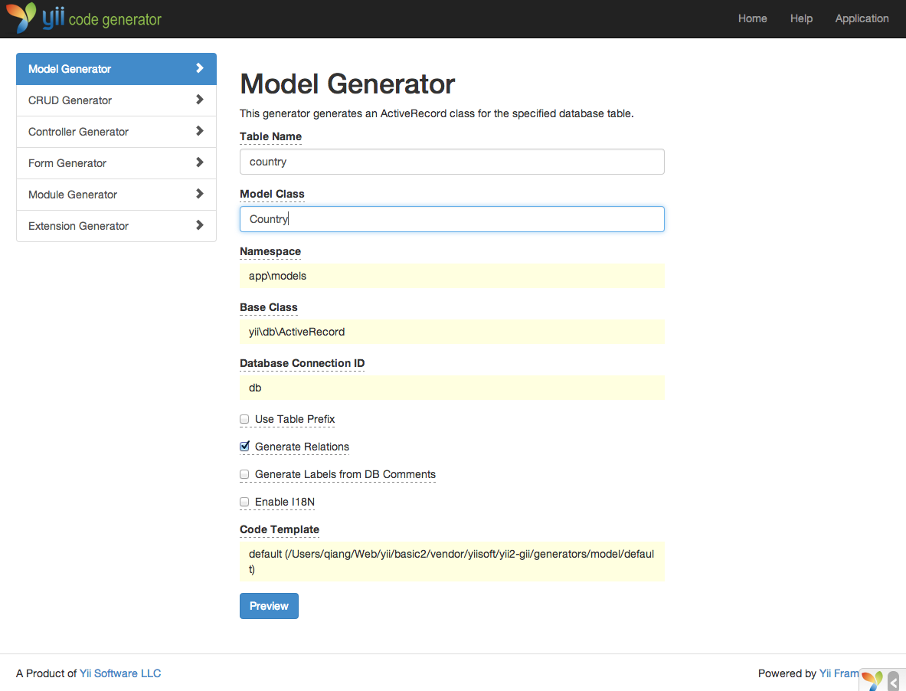
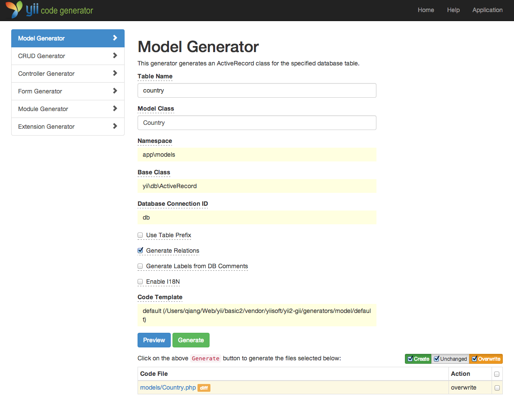
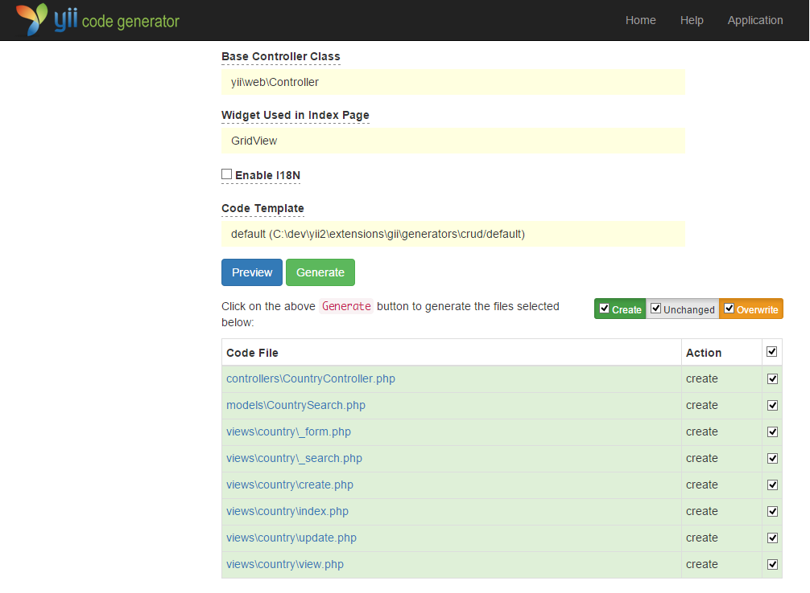

Gii로 코드 만들기
=================

이번 섹션에서는 [Gii](tool-gii.md)를 사용하여 웹사이트의 일반적인 기능중 일부를 구현하는 코드를 자동으로 생성하는 방법을 설명합니다. Gii를 사용해 코드를 자동 생성하는 것은 단순히 Gii 웹페이지에 정보를 보여주는 것이 아닙니다.

이 튜토리얼을 통해, 다음을 배우게 됩니다.

* 응용프로그램에서 Gii를 활성화하는 방법
* Gii를 사용하여 엑티브 레코드를 활성화 하는 방법
* Gii를 사용하여 DB테이블에 CRUD 작업을 구현 코드를 만드는 방법
* Gii에 의해 생성된 코드를 커스텀마이징 하는 방법


Gii 시작<span id="starting-gii"></span>
------------

[Gii](tool-gii.md)는 Yii [module](structure-modules.md)로 제공 되고 있습니다.
Gii 는 응용프로그램의 [[yii\base\Application::modules|modules]] 속성에서 설정후 활성화 할 수 있습니다. 응용 프로그램을 생성하는 방법에 따라, `config/web.php` 설정 파일에 다음의 코드가 이미 제공 되고 있을 것입니다.

```php
$config = [ ... ];

if (YII_ENV_DEV) {
    $config['bootstrap'][] = 'gii';
    $config['modules']['gii'] = 'yii\gii\Module';
}
```

위의 설정 정보는 [개발 환경](concept-configurations.md#environment-constants)에서 응용 프로그램의 `gii`라는 모듈 이름으로 포함되며 [[yii\gii\Module]] 라는 클래스를 생성합니다.

응용프로그램 [시작 스크립트](structure-entry-scripts.md)의 `web/index.php`를 체크 하면, 다음 줄을 찾을 수 있습니다. 이것은 처음부터 `YII_ENV_DEV`가 true 로 설정 됩니다.

```php
defined('YII_ENV') or define('YII_ENV', 'dev');
```

이 라인 덕분에 응용 프로그램은 이미 개발자 모드로 되어 있으며, 위의 설정 정보에 의해 Gii가 활성화 되어 있습니다. 이제 다음 URL에 의해 Gii에 접속 할수 있습니다.

```
http://hostname/index.php?r=gii
```

> Note | 참고: 로컬호스트가 아닌 컴퓨터에 에서 Gii에 접속하려 하면 기본적으로 보안상의 이유로 접속이 거부 됩니다.
> 아래 Gii 설정에서 허용 IP주소 를 추가 할 수  

>
```php
'gii' => [
    'class' => 'yii\gii\Module',
    'allowedIPs' => ['127.0.0.1', '::1', '192.168.0.*', '192.168.178.20'] // adjust this to your needs
],
```


엑티브 레코드 클래스 만들기 <span id="generating-ar"></span>
---------------------------

Gii를 사용하여 엑티브 레코드 클래스를 생성하는데 "Model Generator" 를 선택합니다.(Gii 인덱스 페이지의 링크를 클릭) 그리고 다음과 같이 입력합니다.

* Table Name: `country`
* Model Class: `Country`



다음에는 "Preview" 버튼을 클릭합니다. 그러면 결과적으로 작성되는 클래스 파일의 목록에 `models/Country.php`가 나옵니다.
클래스 파일의 이름을 클릭하면 내용을 미리 볼 수 있습니다.

Gii를 이용할때, 이미 동일한 파일이 생성되어 있고 그것을 수정하려면 파일이름 옆의 `diff`버튼을 클릭하여 생성되는 코드와 기존 버전의 차이점을 볼 수 있습니다.



기존 파일을 덮어 쓸때 "overwrite" 옆의 확인란을 체크 한 후 "Generate" 버튼을 클릭 합니다. 새 파일을 만들때는, "Generate"만 클릭하면 됩니다.

다음에는 코드 생성이 완료 되었다는 확인 페이지가 표시 됩니다.
기존 파일의 경우는 새로 생성 된 코드에서 덮어쓸 수 없다는 메시가 표시됩니다.


CRUD Code 만들기<span id="generating-crud"></span>
----------------

CRUD는 Create(만들기), Read(읽기), Update(업데이트), 그리고 Delete(삭제) 를 의미하며, 대부분 웹사이트에서 데이타를 처리할 때 흔히 사용되는 4가지 작업을 나타 냅니다.
Gii를 사용 하여 CRUD 긴ㅇ을 사용하기 위해서는, "CRUD Generator"를 선택 하세요.(Gii 인덱스 페이지의 링크를 클릭 하세요)
샘플 "country"의 폼에 다음과 같이 입력 합니다.

* Model Class: `app\models\Country`
* Search Model Class: `app\models\CountrySearch`
* Controller Class: `app\controllers\CountryController`


다음에는 "Preview" 버튼을 클릭 합니다. 생성된 파일의 목록은 다음과 같습니다.



이전 (데이터베이스 가이드) `controllers/CountryController.php` 및 `views/country/index.php` 파일을 만드는 경우 해당 파일을 바꾸기 위해 "overwrite" 체크를 선택하세요.(이전 버전에서는 전체 CRUD 기능을 지원하지 않습니다.)


출력 <span id="trying-it-out"></span>
-----

어떻게 작동하는지 보기 위해 브라우저의 URL에 다음과 같이 접속합니다.

```
http://hostname/index.php?r=country/index
```

데이타 베이스 테이블에서 검색된 정보가 그리드표로  화면에 표시 됩니다.
그리드 표를 정렬하거나 열 헤더에 검색 조건을 입력하여 검색 필터를 적용 할수 있습니다.

그리드에 표시된 각 나라들의 세부 정보를 보거나, 또는 삭제 할수 있습니다.
그리드 상단에 있는 "Create Country" 버튼을 클릭하여 새로운 국가를 입력하기 위하여 폼 을 사용할수 있습니다.


Gii에 의해 생성되는 파일의 목록입니다. 위의 기능들이 어떻게 작동하는 보고 싶다면 아래 파일들을 참조 하세요.

* Controller: `controllers/CountryController.php`
* Models: `models/Country.php` and `models/CountrySearch.php`
* Views: `views/country/*.php`

> Info | 정보: Gii는 사용자 정의하고 확장 가능한 코드 생성 도구로 설계되어 있습니다. 이것을 잘 사용하면 응용 프로그램의 개발 속도를 높일수 있습니다. 이것에 대한 자세한 내용은 [Gii](tool-gii.md) 을 참조 하세요.


정리 <span id="summary"></span>
-----

이번 섹션에서는 Gii를 사용하여 코드를 생성하고, 데이타베이스 테이블에 저장된 콘텐츠를 위한 완벽한 CRUD 기능을 구현하는 방법을 배웠습니다.