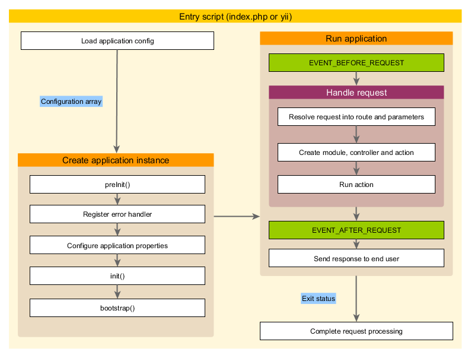

응용 프로그램
================

응용 프로그램은 Yii 응용 프로그램 전체 시스템의 구조와 라이프 사이클을 관리하는 객체입니다.
모든 Yii 응용 시스템은 각각 하나의 응용 프로그램 객체를 가집니다.
응용 프로그램 개체는 항목 스크립트 (structure-entry-scripts.md)에서 생성 된 `\Yii::$app`는 식으로 글로벌 하게  액세스 할 수있는 객체입니다.

> Info|정보 : 가이드에서 "응용 프로그램"이라는 용어는 문맥에 따라 응용 프로그램 개체를 의미하고, 응용 시스템을 의미하기도합니다.

응용 프로그램은 두가지의 유형이 있습니다. [[yii\web\Application|Web applications]] 과 [[yii\console\Application|console applications]]
이름에서 알 수 있듯이, 전자는 주로 웹 요청을 처리하고, 후자는 콘솔 명령 요청을 처리합니다.


##응용 프로그램의 구성 정보 <span id="application-configurations"></span>

[항목 스크립트 (structure-entry-scripts.md) 응용 프로그램을 만들 때 다음과 같이 구성 정보 (concept-configurations.md)를 읽어 들여, 그것을 응용 프로그램에 적용합니다.

```php
require(__DIR__ . '/../vendor/autoload.php');
require(__DIR__ . '/../vendor/yiisoft/yii2/Yii.php');

//load application configuration
$config=require(__DIR__ . '/../config/web.php');

//instantiate and configure the application
(new yii\web\Application($config))->run();
```

일반 구성 정보 (concept-configurations.md)와 같이 응용 프로그램의 구성 정보는 Application 개체의 속성을 어떻게 초기화 할 것인지를 지정하는 것입니다.
응용 프로그램의 구성 정보는 대부분 매우 복잡한 것이기 때문에, 일반적으로 위의 예에서 `web.php` 파일과 같이 구성 정보 파일 (concept-configurations.md#configuration-files)에 보관 됩니다.


##응용 프로그램의 속성 <span id="application-properties"></span>

응용 프로그램의 구성 정보로 구성해야 할 중요한 응용 프로그램의 속성은 많이 있습니다.
이러한 속성은 일반적으로 응용 프로그램에서 실행되는 환경을 설명합니다.
예를 들어, 응용 프로그램은 어떻게 컨트롤러 (structure-controllers.md)를 로드하거나 또한 어디에 임시 파일을 저장하는지 등을 알아야합니다.
다음에서 해당 속성을 요약합니다.


###필수 속성 <span id="required-properties">/span>

어떤 응용 프로그램에서도 최소한 두 속성은 구성해야합니다.
즉, [[yii\base\Application::id|id]] 및 [[yii\base\Application::basePath|basePath]]입니다.


####[[yii\base\Application::id|id]] <] <span id="id"></span>

[[yii\base\Application::id|id]] 속성은 응용 프로그램을 차별화된 고유한 ID를 지정합니다.
이 속성은 주로 프로그램 내부에서 사용됩니다.
필수는 아니지만 최선의 상호 운용성을 보장하기 위해 응용 프로그램 ID를 지정할 때 숫자 만 사용하는 것을 추천 합니다.


####[[yii\base\Application::basePath|basePath]] <span id="basePath"></span>

[[yii\base\Application::basePath|basePath]] 속성은 응용 프로그램의 루트 디렉토리를 지정합니다.
이것은 응용 시스템의 모든 보호 된 소스 코드를 포함하는 디렉토리입니다.
일반적으로이 디렉토리 아래 MVC 패턴에 해당하는 소스 코드를 포함 한 `models` `views` `controllers` 등의 하위 디렉토리가 있습니다.

[[yii\base\Application::basePath|basePath]]  속성의 구성 디렉터리 경로를 사용해도, 경로 별칭 (concept-aliases.md)를 사용해도 상관 없습니다.
어느 쪽의 형식에서도 해당 디렉토리가 존재해야합니다.
그렇지 않다면 예외가 던져집니다.
경로는 `realpath()` 함수를 호출하여 정규화됩니다.

[[yii\base\Application::basePath|basePath]]속성은 종종 다른 중요한 경로 (예 : runtime 경로)를 파생시키는 데 사용됩니다.
따라서 `basePath` 을 나타내는`@app`라는 경로 별칭이 미리 정의되어 있습니다.
그 결과, 파생적인 경로는이 별칭을 사용하여 형성 할 수 있습니다
(예 : runtime 디렉토리를 나타내는`@ app/runtime` 등).


###중요한 속성 <span id="important-properties">/span>

이 절에서 설명하는 속성은 응용 프로그램마다 달라지는 것이기 때문에 대부분 구성해야 할 수도 있습니다.


####[[yii\base\Application::aliases|aliases]] <span id="aliases"></span>

이 속성을 사용하여 배열 형식으로 일련의 별칭 (concept-aliases.md)를 정의 할 수 있습니다.
배열의 키가 별칭의 이름이며, 배열의 값이 해당 경로의 정의입니다.
예를 들어,

```php
[
    'aliases'=> [
        '@name1'=> 'path/to/path1',
        '@name2'=> 'path/to/path2',
    ],
]
```

이 속성이 제공되는 것은 [[Yii::setAlias()]] 메소드를 호출하는 대신 응용 프로그램의 구성 정보를 사용하여 별칭을 정의 할 수있게하는 것입니다.


####[[yii\base\Application::bootstrap|bootstrap]] <span id="bootstrap"></span>

이것은 매우 유용한 속성입니다.
따라서 응용 프로그램의 [[yii\base\Application::bootstrap()|bootstrapping process]] 에서 달리게 할 구성 요소를 배열로 지정할 수 있습니다.
예를 들어, 모듈 (structure-modules.md)에 [URL 규칙 (runtime-routing.md)를 정의하고자 할 경우에 모듈 ID를이 속성의 요소로 꼽을 수 있습니다.

이 속성에 나열된 각 구성 요소는 다음 형식 중 하나로 지정할 수 있습니다.

- [components] (#components)에 의해 지정된 응용 프로그램 구성 요소의 ID
- [modules (#modules)에 의해 지정되는 모듈의 ID
- 클래스 이름
- 구성 정보의 배열
- 구성 요소를 작성해 돌려주는 익명 함수

예를 들어,

```php
[
    'bootstrap'=> [
       //an application component ID or module ID
        'demo',

       //a class name
        'app\components\Profiler',

       //a configuration array
        [
            'class'=> 'app\components\Profiler',
            'level'=> 3,
        ],

       //an anonymous function
        function () {
            return new app\components\Profiler();
        }
    ],
]
```

> Info|정보 :  동일한 모듈 ID 응용 프로그램 구성 요소가 있으면 부트 스트랩 과정에서 응용 프로그램 구성 요소가 사용됩니다.
> 대신 모듈을 사용하려면, 다음과 같이 익명 함수를 사용하여 지정할 수 있습니다.
>
> ```php
> [
>     function () {
>         return Yii::$app->getModule('user');
>     },
> ]
> ```

부트 스트랩 과정에서 각 구성 요소의 인스턴스가 작성됩니다.
그리고 구성 요소 클래스가 [[yii\base\BootstrapInterface]]를 구현하고있는 경우, [[yii\base\BootstrapInterface::bootstrap()|bootstrap()]] 메소드도 호출됩니다.

또 다른 실용적인 예제가 기본 프로젝트 템플릿 (start-installation.md) 응용 프로그램의 구성 정보에 있습니다.
거기에서는 응용 프로그램 개발 환경에서 달릴 때 `debug` 모듈과 `gii` 모듈 부트 스트랩 구성 요소로 구성되어 있습니다.

```php
if (YII_ENV_DEV) {
   //configuration adjustments for 'dev' environment
    $config['bootstrap'][]='debug';
    $config['modules']['debug']='yii\debug\Module';

    $config['bootstrap'][]='gii';
    $config['modules']['gii']='yii\gii\Module';
}
```

> Note|주의 : 너무 많은 구성 요소를 `bootstrap` 놓으면 응용 프로그램의 성능을 저하시킵니다.
  왜냐하면 요청때 마다 같은 일련의 구성 요소를 실행시켜야하기 때문입니다.
  그래서 부트 스트랩 구성 요소는 신중히 사용하여야 합니다.


####[[yii\web\Application::catchAll|catchAll]] <span id="catchAll"></span>

이 속성은 [[yii\web\Application|Web applications]] 웹 응용 프로그램]에서만 지원됩니다.
이것은 모든 사용자 요청을 처리하고 [컨트롤러 액션] (structure-controllers.md)을 지정하는 것입니다.
이는 주로 응용 프로그램이 유지 관리 모드에 있고 들어오는 모든 요청을 단일 작업으로 처리 할 필요가있을 때 사용됩니다.

구성 정보는 배열의 형태를 가지고 첫 번째 요소는 액션의 경로를 지정합니다.
그리고 배열의 나머지 요소 (키 값 쌍)은 액션에 전달 된 매개 변수를 지정합니다.
예를 들어,

```php
[
    'catchAll'=> [
        'offline/notice',
        'param1'=> 'value1',
        'param2'=> 'value2',
    ],
]
```


####[[yii\base\Application::components|components]] <span id="components"></span>

이것은 가장 중요한 속성입니다.
따라서 응용 프로그램 구성 요소 (structure-application-components.md)라는 일련의 명명 된 구성 요소를 등록하여 그들을 다른 곳에서 사용할 수있게합니다.
예를 들어,

```php
[
    'components'=> [
        'cache'=> [
            'class'=> 'yii\caching\FileCache',
        ],
        'user'=> [
            'identityClass'=> 'app\models\User',
            'enableAutoLogin'=> true,
        ],
    ],
]
```

모든 응용 프로그램 구성 요소는 각각 배열에서 "키-값" 쌍으로 지정됩니다.
키는 구성 요소의 ID를 나타내며 값은 구성 요소 클래스 이름 또는 구성 정보 (concept-configurations.md)를 보여줍니다.

어떤 구성 요소에서 응용 프로그램에 등록 할 수 있습니다.
그리고 등록 된 구성 요소는 나중에 `\Yii::$app->componentID` 수식을 사용하여 전역에 액세스 할 수 있습니다.

자세한 내용은 응용 프로그램 구성 요소 (structure-application-components.md) 절을 읽어보십시오.


####[[yii\base\Application::controllerMap|controllerMap]] <span id="controllerMap"></span>

이 속성은 컨트롤러 ID를 임의의 컨트롤러 클래스에 할당 할 수 있도록하는 것입니다.
기본적으로 Yii는 [약관] (#controllerNamespace)에 따라 컨트롤러 ID를 컨트롤러 클래스에 할당합니다
(예를 들어,`post`라는 ID는`app\controllers\PostController` 에 할당됩니다).
이 속성을 구성하여 특정 컨트롤러에 대한 규칙을 깰 수 있습니다.
아래의 예에서는`account`는 `app\controllers\UserController`에 할당 `article` 는`app\controllers\PostController` 배정 받게됩니다.

```php
[
    'controllerMap'=> [
        [
            'account'=> 'app\controllers\UserController',
            'article'=> [
                'class'=> 'app\controllers\PostController',
                'enableCsrfValidation'=> false,
            ],
        ],
    ],
]
```

이 속성의 배열의 키는 컨트롤러 ID를 나타내며, 배열의 값은 대응하는 컨트롤러 클래스의 이름 또는 구성 정보 (concept-configurations.md)를 나타냅니다.


####[[yii\base\Application::controllerNamespace|controllerNamespace]] <span id="controllerNamespace"></span>

이 속성은 컨트롤러 클래스가 배치되어야 하는 기본 네임 스페이스를 지정하는 것입니다.
기본값은`app\controllers`입니다.
컨트롤러 ID가 `post` 인 경우, 약관에 따라 대응하는 컨트롤러 (네임 스페이스를 생략 한) 클래스 이름은 `PostController` 되어, 정규화 된 클래스 이름은 `app\controllers\PostController` 입니다.

컨트롤러 클래스는이 네임 스페이스에 해당하는 디렉토리의 하위 디렉토리에 배치 되어도 상관 없습니다.
예를 들어, 컨트롤러 ID로 `admin/post` 를 가정하면 해당 컨트롤러의 정규화 된 클래스 이름은 `app\controllers\admin\PostController` 입니다.

중요한 것은 정규화 된 컨트롤러 클래스가 자동로드 가능 (concept-autoloading.md)이어야하고, 컨트롤러 클래스의 실제 네임 스페이스가이 속성과 일치해야한다는 것 입니다.
그렇지 않으면 응용 프로그램에 액세스 할 때 "페이지를 찾을 수 없습니다"라는 오류를 받게됩니다.

위에서 설명 된 규칙을 깨고 싶다 경우 controllerMap (#controllerMap) 속성을 구성 할 수 있습니다.


####[yii\base\Application::language|language] <span id="language"></span>

이 속성은 응용 프로그램이 콘텐츠를 최종 사용자에게 표시 할 때 사용 할 언어를 지정하는 것입니다.
이 속성의 기본값은 `en` 이며, 영어를 의미합니다.
응용 프로그램이 다국어를 지원해야 할 때이 속성을 구성해야합니다.

이 속성 값이 메시지 번역기 날짜 형식 숫자 서식 등 [국제화] (tutorial-i18n.md)의 다양한 측면을 결정합니다.
예를 들어, [yii\jui\DatePicker] 위젯은 어떤 언어로 달력을 표시 해야할지, 그리고 날짜를 어떻게 서식 해야할지 기본적으로이 속성을 사용하여 결정합니다.

언어를 지정하려면, IETF 언어 태그 (http://en.wikipedia.org/wiki/IETF_language_tag)에 따르는 것이 권장됩니다.
예를 들어,`en` 영어를 의미하고,`en-US`는 미국 영어를 의미합니다.

이 속성에 대한 자세한 내용은 [세계화] (tutorial-i18n.md) 절에서 읽을 수 있습니다.


####[yii\base\Application::modules|modules] <span id="modules"></span>

이 속성은 응용 프로그램이 포함된 모듈 (structure-modules.md)을 지정하는 것입니다.

이 속성은 모듈의 ID를 키로 사용하는 모듈의 클래스 또는 구성 정보 (concept-configurations.md)의 배열입니다.
예를 들어,

```php
[
    'modules' => [
        // a "booking" module specified with the module class
        'booking' => 'app\modules\booking\BookingModule',

        // a "comment" module specified with a configuration array
        'comment' => [
            'class' => 'app\modules\comment\CommentModule',
            'db' => 'db',
        ],
    ],
]
```

자세한 내용은 다음 모듈 (structure-modules.md) 절을 참조하십시오.


#### [[yii\base\Application::name|name]] <span id="name"></span>

이 속성은 최종 사용자에게 표시되는 응용 프로그램 이름을 지정하는 것입니다.
[[yii\base\Application::id|id]]속성이 고유 값을 취해야한다 것과는 달리,이 속성의 값은 주로 표시 목적이며, 고유 할 필요는 없습니다.

코드의 어디에도 사용하지 않는다면이 속성은 반드시 구성 할 필요가 없습니다.


#### [[yii\base\Application::params|params]] <span id="params"></span>

이 속성은 전역으로 액세스 할 수있는 응용 프로그램 매개 변수의 배열을 지정하는 것입니다.
코드 안쪽에서 하드 코딩 된 숫자 또는 문자열을 사용하는 대신에 그들을 응용 프로그램 매개 변수로 한자리에서 정의하고 필요한 장소에서 매개 변수를 사용하는 것이 좋은 방법입니다.
예를 들어, 다음과 같이, 썸네일 이미지의 크기를 매개 변수로 정의 할 수 있습니다.

```php
[
    'params' => [
        'thumbnail.size' => [128, 128],
    ],
]
```

그리고이 크기 값을 사용해야하는 코드에서는 아래와 같은 코드를 사용하는 것만으로 끝 마칠 수 있습니다.

```php
$size = \Yii::$app->params['thumbnail.size'];
$width = \Yii::$app->params['thumbnail.size'][0];
```

나중에 썸네일의 크기를 변경하기로 결정하면 응용 프로그램의 구성 정보에서만 크기를 수정하면되고, 이것에 의존하는 코드는 조금도 수정할 필요가 없습니다.


#### [[yii\base\Application::sourceLanguage|sourceLanguage]] <span id="sourceLanguage"></span>

이 속성은 응용 프로그램 코드를 작성하는 언어를 지정합니다.
기본값은` 'en-US'`, 미국 영어입니다.
당신의 코드의 텍스트 콘텐츠가 영어 이외로 작성된 경우는 속성을 구성해야합니다.

[language] (#language) 속성과 마찬가지로이 속성은 IETF 언어 태그 (http://en.wikipedia.org/wiki/IETF_language_tag)에 따라 구성해야합니다.
예를 들어,`en` 영어를 의미하고,`en-US`는 미국 영어를 의미합니다.

이 속성에 대한 자세한 내용은 [국제화] (tutorial-i18n.md) 절에서 읽을 수 있습니다.


#### [[yii\base\Application::timeZone|timeZone]] <span id="timeZone"></span>

이 속성은 PHP 런타임의 기본 시간대를 설정하는 또 다른 방법으로 제공됩니다.
이 속성을 구성함으로써 본질적으로는 PHP 함수 [date_default_timezone_set()](http://php.net/manual/en/function.date-default-timezone-set.php) 를 호출 할 수 있습니다 .
예를 들어,

```php
[
    'timeZone'=> 'Asia/Seoul'
]
```


#### [[yii\base\Application::version|version]] <span id="version"></span>

이 속성은 응용 프로그램의 버전을 지정하는 것입니다. 기본값은` '1.0'`입니다.
코드에서 전혀 사용하지 않는다면 반드시 구성 할 필요가 없습니다.


### 유용한 속성 <span id="useful-properties"></span>

이 절에서 설명되는 속성은 일반적으로 구성되지 않습니다. 라는 것은 그 기본 값이 정상 약관를 지정하고 있기 때문입니다.
그러나 약관을 깰 필요가있는 경우에는 이러한 속성을 구성 할 수 있습니다.


#### [[yii\base\Application::charset|charset]] <span id="charset"></span>

이 속성은 응용 프로그램이 사용하는 문자 집합을 지정하는 것입니다.
기본값은` 'UTF-8'`이며, 당신의 응용 프로그램이 다수의 비 유니 코드 데이터를 사용 레거시 시스템과 연계하는 것이 아니라면, 대부분의 응용 프로그램은 그대로 두어야합니다.


#### [[yii\base\Application::defaultRoute|defaultRoute]] <span id="defaultRoute"></span>

이 속성은 요청이 루트를 지정하지 않은 경우 응용 프로그램이 사용해서는 루트 (runtime-routing.md)를 지정하는 것입니다.
루트는 child 모듈 ID 컨트롤러 ID 및/또는 작업 ID를 구성 요소로하는 것이 가능합니다.
예를 들어, `help`, `post/create`, 또는 `admin/post/create` 등입니다.
액션 ID가 주어지지 않는 경우 [[yii\base\Controller::defaultAction]에서 지정한 기본 값을 취합니다.

[[yii\web\Application|Web applications]]에서 이 속성의 기본값은 ` 'site'` 이며, 그 의미는 `SiteController` 컨트롤러 및 기본 액션이 사용되어야한다 는 것입니다.
결과적으로 경로를 지정하지 않고 응용 프로그램에 액세스하면 `app\controllers\SiteController::actionIndex()` 의 결과가 표시됩니다.

 [[yii\console\Application|console applications]]에서 기본값은` 'help'`이며, 핵심 명령 [[yii\console\controllers\HelpController::actionIndex()]]가 사용 되어야 한다 있다는 의미입니다.
결과적으로 인수에 아무런 값을 주지 않고  `yii`라는 명령을 실행하면 도움말 정보가 표시 됩니다.


#### [[yii\base\Application::extensions|extensions]] <span id="extensions"></span>

이 속성은 응용 프로그램에 설치되어 사용되고있는 확장 (structure-extensions.md)의 목록을 지정하는 것입니다.
기본적으로 `@vendor/yiisoft/extensions.php` 라는 파일에 의해 반환되는 배열을 가지고 있습니다.
`extensions.php`은[Composer](https://getcomposer.org) 를 사용하여 확장을 설치하면 자동으로 생성되고 유지 보수됩니다.
따라서 대부분의 경우 속성을 구성 할 필요가 없습니다.

확장을 수동으로 관리하고자하는 특별한 경우에 있어서는 다음과 같이이 속성을 구성 할 수 있습니다.

```php
[
    'extensions' => [
        [
            'name' => 'extension name',
            'version' => 'version number',
            'bootstrap' => 'BootstrapClassName',  // optional, may also be a configuration array
            'alias' => [  // optional
                '@alias1' => 'to/path1',
                '@alias2' => 'to/path2',
            ],
        ],

        // ... more extensions like the above ...

    ],
]
```

보시다시피이 속성은 확장 사양을 나타내는 배열을 가지고 있습니다.
각각의 확장은`name`와`version` 요소를 포함한 배열에 의해 지정됩니다.
확장이 [부트 스트랩] (runtime-bootstrapping.md) 과정에서 달릴 필요가있는 경우에는`bootstrap` 요소를 부트 스트랩 클래스 이름 또는 구성 정보 (concept-configurations.md)의 배열에 의해 지정 할 수 있습니다.
또한 확장은 여러 별칭 (concept-aliases.md)을 정의 할 수도 있습니다.


#### [[yii\base\Application::layout|layout]] <span id="layout"></span>

이 속성은 뷰 (structure-views.md)를 렌더링하는 데 사용되어야 기본 레이아웃을 지정하는 것입니다.
기본값은` 'main'`이며, 레이아웃 경로 (#layoutPath) 아래에있는`main.php`라는 파일이 사용되어야 함을 의미합니다.
레이아웃 경로 (#layoutPath) 및 뷰패스 (#viewPath) 모두 기본값을 사용하면, 기본 레이아웃 파일은`@app/views/layouts/main.php`라는 경로 별칭으로 나타낼 수 합니다.

좀처럼없는 일이지만, 레이아웃을 기본적으로 해제하려면이 속성을 `false` 로 구성 할 수 있습니다.


####  [[yii\base\Application::layoutPath|layoutPath]] <span id="layoutPath"></span>

이 속성은 레이아웃 파일이 발견 될 경로를 지정하는 것입니다.
기본값은 [뷰패스 (#viewPath) 아래의 `layouts` 하위 디렉토리입니다.
[뷰패스 (#viewPath)이 기본값을 사용하면, 기본 레이아웃 경로는`@app/views/layouts`라는 경로 별칭으로 나타낼 수 있습니다.

이 속성은 디렉토리 또는 경로 별칭 (concept-aliases.md)로 구성 할 수 있습니다.


#### [[yii\base\Application::runtimePath|runtimePath]] <span id="runtimePath"></span>

이 속성은 로그 파일이나 캐시 파일 등의 임시 파일을 생성 할 수있는 경로를 지정하는 것입니다.
기본값은`@app/runtime`이라는 별칭으로 표현되는 디렉토리입니다.

이 속성은 디렉토리 또는 경로 별칭 (concept-aliases.md)로 구성 할 수 있습니다.
런타임 경로는 응용 프로그램을 실행하는 과정을 통해 쓸 수있는 것이어야한다는 것에주의하십시오.
그리고이 아래에있는 임시 파일은 은닉을 필요 정보를 포함 할 수있다 것이므로 런타임 경로는 최종 사용자가 액세스로부터 보호되어야합니다.

이 경로에 쉽게 액세스 할 수 있도록 Yii는`@runtime`라는 경로 별칭을 사전에 정의하고 있습니다.


#### [[yii\base\Application::viewPath|viewPath]] <span id="viewPath"></span>

이 속성은 뷰 파일이 배치되는 루트 디렉토리를 지정합니다.
기본값은`@app/views`이라는 별칭으로 표현되는 디렉토리입니다.
이 속성은 디렉토리 또는 경로 별칭 (concept-aliases.md)로 구성 할 수 있습니다.


#### [[yii\base\Application::vendorPath|vendorPath]] <span id="vendorPath"></span>

이 속성은 [Composer] (https://getcomposer.org)에 의해 관리되는 vendor 디렉토리를 지정하는 것입니다.
Yii 프레임 워크를 포함하여 당신의 응용 프로그램에서 사용되는 모든 타사 라이브러리를 포함하는 디렉토리입니다.
기본값은 `@app/vendor`이라는 별칭으로 표현되는 디렉토리입니다.

이 속성은 디렉토리 또는 경로 별칭 (concept-aliases.md)로 구성 할 수 있습니다.
이 속성을 수정하면 반드시 Composer의 구성도 그에 맞게 수정 해야 합니다.

이 경로에 쉽게 액세스 할 수 있도록 Yii는`@vendor`라는 경로 별칭을 사전에 정의하고 있습니다.


#### [[yii\console\Application::enableCoreCommands|enableCoreCommands]] <span id="enableCoreCommands"></span>

이 속성은 [[yii\console\Application|console applications]]에서만 지원됩니다.
Yii 릴리스에 포함 된 핵심 명령을 사용할지 여부를 지정합니다. 기본값은`true`입니다.


## 응용 프로그램 이벤트 <span id="application-events"></span>

응용 프로그램은 요청을 처리하는 라이프 사이클에서 여러 이벤트를 트리거합니다.
이 이벤트에 대해 아래와 같이하여 응용 프로그램의 구성 정보에서 이벤트 핸들러를 첨부 할 수 있습니다.

```php
[
    'on beforeRequest' => function ($event) {
        // ...
    },
]
```

`on eventName` 구문의 사용법에 대해서는 구성 정보 (concept-configurations.md#configuration-format) 절에 설명되어 있습니다.

다른 방법으로 응용 프로그램의 인스턴스가 생성 된 후 부트 스트랩 과정 (runtime-bootstrapping.md)에서 이벤트 핸들러를 첨부 할 수도 있습니다.
예를 들어,

```php
\Yii::$app->on(\yii\base\Application::EVENT_BEFORE_REQUEST, function ($event) {
    // ...
});
```

### [[yii\base\Application::EVENT_BEFORE_REQUEST|EVENT_BEFORE_REQUEST]] <span id="beforeRequest"></span>

이 이벤트는 응용 프로그램이 요청을 처리하기 *전*에 트리거됩니다.
실제 이벤트 이름은 `beforeRequest`입니다.

이 이벤트가 트리거 될 때 응용 프로그램의 인스턴스가 이미 구성되어 초기화되어 있습니다.
따라서 이벤트 메커니즘을 사용하여 요청 처리 과정을 방해 지정 코드를 삽입하려면, 그냥 좋은 장소입니다.
예를 들어,이 이벤트 처리기에서 어떤 매개 변수에 따라 [[yii\base\Application::language]] 속성을 동적으로 설정할 수 있습니다.


### [[yii\base\Application::EVENT_AFTER_REQUEST|EVENT_AFTER_REQUEST]] <span id="afterRequest"></span>

이 이벤트는 응용 프로그램이 요청의 처리를 완료 한 *후* 응답을 보내기 *전*에 트리거됩니다.
실제 이벤트 이름은`afterRequest`입니다.

이 이벤트가 트리거 될 때 요청의 처리는 완료하고 있으므로이 기회를 포착하여 요청에 대한 어떤 처리를하거나 응답을 사용자 정의 할 수 있습니다.

[yii\web\Response|response] 구성 요소도 최종 사용자에게 응답의 콘텐츠를 전송하는 동안 몇 가지 이벤트를 트리거하는 것에주의하십시오.
그 이벤트는이 이벤트 * 후 * 트리거됩니다.


## [yii \ base \ Application :: EVENT_BEFORE_ACTION | EVENT_BEFORE_ACTION] <span id = "beforeAction"> </ span>

이 이벤트는 컨트롤러 액션] (structure-controllers.md)를 실행 * 전 *마다 트리거됩니다.
실제 이벤트 이름은`beforeAction`입니다.

이벤트의 매개 변수는 [yii \ base \ ActionEvent]]의 인스턴스입니다.
이벤트 핸들러는 [yii \ base \ ActionEvent :: isValid] 속성을`false`에 넣고 액션의 실행을 중지 할 수 있습니다.
예를 들어,

```php
[
    'on beforeAction'=> function ($ event) {
        if (어떠한 조건) {
            $ event-> isValid = false;
        } else {
        }
    },
]
```

같은`beforeAction` 이벤트가 다음 모듈 (structure-modules.md) 및 컨트롤러 (structure-controllers.md)에서도 트리거되는 것에주의하십시오.
응용 프로그램 개체가 처음으로이 이벤트를 트리거 한 다음 (있는 경우) 모듈, 그리고 마지막으로 컨트롤러가이 이벤트를 트리거합니다.
이벤트 핸들러가 [yii \ base \ ActionEvent :: isValid]를`false`로 설정하면 후속 이벤트는 트리거되지 않습니다.


### [[yii\base\Application::EVENT_BEFORE_ACTION|EVENT_BEFORE_ACTION]] <span id="beforeAction"></span>

이 이벤트는 컨트롤러 액션] (structure-controllers.md)를 실행 한 * 후 *마다 트리거됩니다.
실제 이벤트 이름은`afterAction`입니다.

이벤트의 매개 변수는 [[yii\base\ActionEvent]] 의 인스턴스입니다.
 [[yii\base\ActionEvent::isValid]] 속성을 통해 이벤트 핸들러는 액션의 결과에 액세스하거나 작업 결과를 수정할 수 있습니다.
예를 들어,

```php
[
    'on beforeAction' => function ($event) {
        if (some condition) {
            $event->isValid = false;
        } else {
        }
    },
]
```

같은`afterAction` 이벤트가 다음 모듈 (structure-modules.md) 및 컨트롤러 (structure-controllers.md)에서도 트리거되는 것에주의하십시오.
이러한 개체는`beforeAction`의 경우와는 반대의 순서로 이벤트를 트리거합니다.
즉, 컨트롤러 객체가 처음이 이벤트를 트리거 한 다음 (있는 경우) 모듈, 그리고 마지막으로 응용 프로그램이 이벤트를 트리거합니다.


## 응용 프로그램 수명주기 <span id = "application-lifecycle"> </ span>



[항목 스크립트 (structure-entry-scripts.md)가 실행되고 요청이 처리 될 때 응용 프로그램은 다음과 같은 라이프 사이클을 거쳐 있습니다.

1. 항목 스크립트가 응용 프로그램의 구성 정보를 배열로 읽어 낸다.
2. 항목 스크립트가 응용 프로그램의 새 인스턴스를 만듭니다.
  * [[yii\base\Application::preInit()|preInit()]] 를 호출하여 [[yii\base\Application::basePath|basePath]]같은 우선 순위가 높은 응용 프로그램 속성을 구성 한다.
  * [[yii\base\Application::errorHandler|error handler]]를 등록한다.
  * 응용 프로그램의 속성을 구성한다.
  * [[yii\base\Application::init()|init()]] 가 호출되고 거기에서 더 부트 스트랩 구성 요소를 실행하기 위해  [[yii\base\Application::bootstrap()|bootstrap()]]가 불린다.
3. 항목 스크립트가 [[yii\base\Application::run()]]을 호출 응용 프로그램을 실행시킨다.
  * [[yii\base\Application::EVENT_BEFORE_REQUEST|EVENT_BEFORE_REQUEST]] 이벤트를 트리거한다.
  * 요청을 처리하는 : 요청을 루트 (runtime-routing.md)와 거기에 결부 매개 변수로 해결한다.
    루트에 의해 지정된 모듈, 컨트롤러 및 조치를 작성한다.
    그리고 작업을 수행한다.
  *  [[yii\base\Application::EVENT_AFTER_REQUEST|EVENT_AFTER_REQUEST]]이벤트를 트리거한다.
  * 최종 사용자에게 응답을 전송한다.
4. 항목 스크립트가 응용 프로그램에서 종료 상태를 수신 요청의 처리를 완료한다.